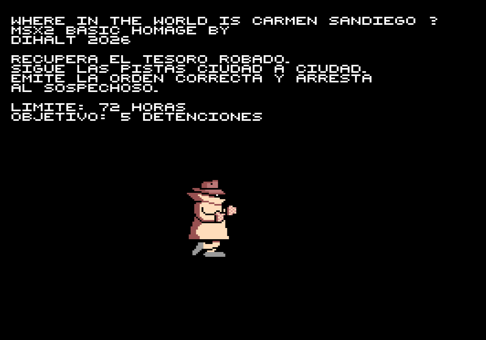
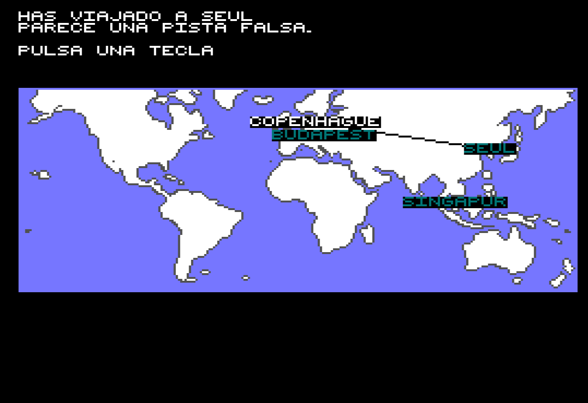
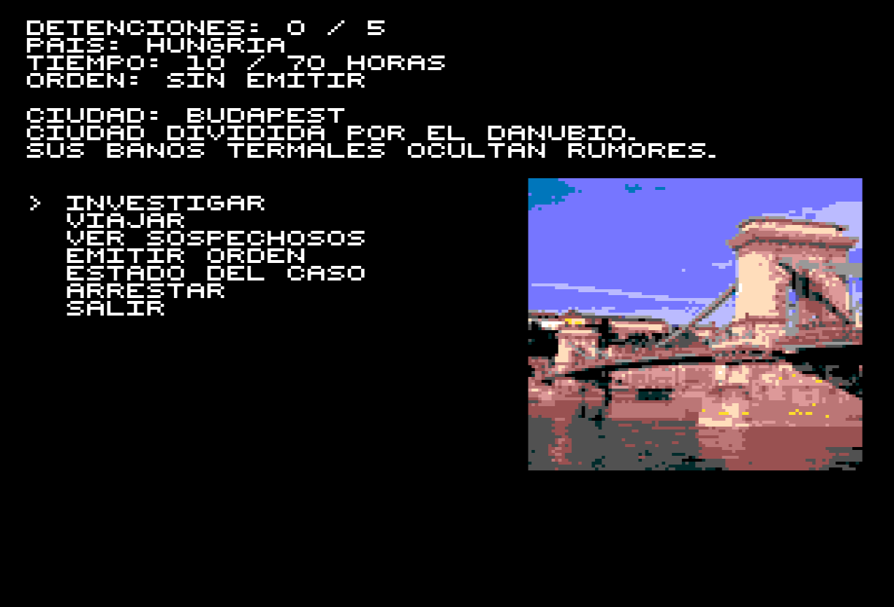

# Carmen Sandiego para MSX2


Una aventura de investigacion inspirada en **Where in the World Is Carmen
Sandiego?**, creada especificamente para MSX2. El proyecto esta desarrollado
principalmente en MSX BASIC 2.0, con apoyo de una pequena rutina Z80 para
acelerar el texto y las copias de VRAM en `SCREEN 5`.

El objetivo es seguir las pistas de ciudad en ciudad, identificar al sospechoso,
emitir una orden correcta y detenerlo antes de que se agote el tiempo. Para
completar la partida hay que resolver cinco casos.

> Proyecto homenaje sin afiliacion con los propietarios de la franquicia
> Carmen Sandiego.

## Capturas

| Introduccion y animaciones | Mapa de viaje | Ciudad y menu principal |
|---|---|---|
|  |  |  |

## Como jugar

Cada caso comienza en una ciudad elegida al azar. Desde la pantalla principal
puedes:

- **Investigar** tres lugares para conseguir pistas sobre el siguiente destino
  o sobre la identidad del sospechoso.
- **Viajar** entre las opciones disponibles. Elegir `NO VIAJAR` vuelve al menu
  sin consumir tiempo.
- **Ver sospechosos** y comprobar cuales han sido detenidos.
- **Emitir orden** usando filtros parciales: sexo, pelo, vehiculo, rasgo y
  aficion.
- **Consultar el estado** del caso, la ruta seguida, el tiempo y las ciudades
  visitadas.
- **Arrestar** cuando hayas llegado a la ciudad final con la orden correcta.

La orden solo se emite si los filtros identifican exactamente a un sospechoso.
Si hay varios candidatos tendras que conseguir mas pistas.

### Controles

- Cursores arriba y abajo: mover el selector.
- Espacio o `RETURN`: aceptar.
- Teclas numericas: seleccion rapida de opciones.
- `NO VIAJAR`: cancelar un viaje sin gastar horas.

Las acciones consumen tiempo: investigar cuesta 2 horas, viajar 6 y calcular
una orden 1. El primer caso permite 70 horas y cada detencion reduce el limite
del siguiente caso en 4 horas.

## Ejecutar el juego

La imagen lista para usar es:

**[Descargar CARMENSANDIEGO_MSX2.dsk](dist/CARMENSANDIEGO_MSX2.dsk)**

Para arrancar:

1. Inserta o monta la imagen `.dsk` como unidad A: en un MSX2 o en un
   emulador como openMSX.
2. Enciende o reinicia el MSX2 con el disco insertado.
3. Disk BASIC ejecutara automaticamente `AUTOEXEC.BAS`, que carga y ejecuta
   `CARMEN5.BAS`. No es necesario escribir ningun comando.

Si el equipo ya ha arrancado y muestra el prompt de BASIC, se puede reiniciar
con el disco insertado o ejecutar manualmente:

```basic
RUN"AUTOEXEC.BAS"
```

El juego carga la pantalla de apertura y espera una pulsacion antes de preparar
los bancos graficos, la paleta y el primer caso.

Requisitos del sistema:

- MSX2 con al menos 64 KiB de RAM y 128 KiB de VRAM.
- MSX BASIC 2.0 y Disk BASIC.
- Unidad o imagen de disco.

## Detalles tecnicos

- Juego principal escrito en MSX BASIC 2.0 y almacenado en
  [`src/CARMEN5.BAS`](src/CARMEN5.BAS).
- Graficos de 16 colores en `SCREEN 5`.
- Sprites hardware deshabilitados; personajes y animaciones usan copias HMMM en VRAM.
- Tres bancos graficos precargados en las paginas 1, 2 y 3 de VRAM.
- Paleta compartida cargada desde `GAMEPAL.SC5`, separada de los bancos para
  no sustituir sus pixeles de Y=237.
- Fuente propia de 6x6 con caracteres ASCII 32 a 93 y `\` como ENE espanola.
- Rutina Z80 ensamblada con Sjasm clasico para dibujar texto mediante comandos
  HMMM del V9938.
- El mapa usa fuente blanca para el origen, una segunda fuente verde HMMM
  opaca para los destinos y una linea de color 0 para la ruta elegida.
- Miniimagenes de ciudad de 100x100, cuantizadas con la paleta de 16 colores
  del juego sin tramado, cargadas una sola vez y cacheadas en VRAM.
- Animaciones sincronizadas con VBlank para pistas, ciudad final, arrestos,
  capturas y derrotas, sin sprites hardware.
- Musica de apertura y efectos de captura, derrota y animacion mediante el
  comando `PLAY` y el PSG del MSX.
- 50 ciudades y 15 sospechosos.
- Fichas, atributos y ciudades almacenados en ficheros `.DAT` externos para no
  ocupar innecesariamente la RAM de BASIC.
- Rutas, destinos y sospechoso generados al azar en cada caso.

Documentacion tecnica:

- [Estructura y variables de CARMEN5.BAS](docs/BASIC.md).
- [Fuente 6x6, protocolo USR y cache](docs/FONT6.md).
- [Catalogo y uso de escenas VRAM](docs/VRAM_SCENES.md).
- [Coordenadas y rotulos del mapa](docs/CITYPOS.md).
- [Formatos de los ficheros de datos](docs/DATA_FILES.md).
- [Paleta y conversion de bancos](docs/PALETTE.md).
- [Generacion de imagenes de ciudad](docs/CITY_IMAGES.md).
- [Construccion completa](docs/BUILD.md).

## Construccion

Para regenerar la imagen de disco se necesitan `mtools` y el ensamblador
**Sjasm clasico** —no SjasmPlus— disponibles en el `PATH`:

```bash
./release.sh
```

El script ensambla `tools/FONT6.ASM`, genera `src/FONT6.BIN` y actualiza
`dist/CARMENSANDIEGO_MSX2.dsk` con el contenido de `src/`.

El listado final esta renumerado consecutivamente de 10 en 10. La utilidad
[`tools/renumber_basic.py`](tools/renumber_basic.py) permite repetir el proceso
sin modificar numeros dentro de cadenas o comentarios y actualiza las
referencias de control de flujo.

La regeneracion de BMP, bancos VRAM o miniimagenes requiere Python 3 y Pillow
y se realiza por separado. Todos los comandos estan en
[`docs/BUILD.md`](docs/BUILD.md). El directorio raiz del disco usa actualmente
sus 112 entradas disponibles, por lo que no se pueden anadir mas ficheros a
`src/` sin reorganizar recursos.

Los ficheros `.BAS` y `.DAT` se mantienen en ASCII con finales de linea DOS
CR/LF para conservar la compatibilidad con MSX/DOS. `src/autoexec.bas` es la
unica excepcion: es un pequeno lanzador tokenizado de MSX BASIC.

## Creditos graficos

Las fotografias fuente de las ciudades proceden de Wikimedia Commons. Autor,
licencia y pagina original de cada una se conservan en
[`IMG_CREDITS.CSV`](IMG_CREDITS.CSV).
