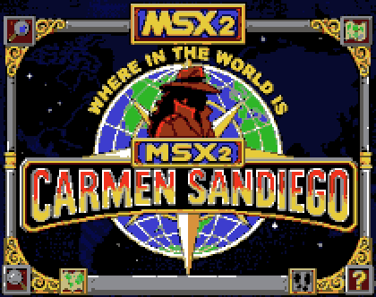

# Carmen Sandiego para MSX2



Una aventura de investigacion inspirada en **Where in the World Is Carmen
Sandiego?**, creada especificamente para MSX2. El proyecto esta desarrollado
principalmente en MSX BASIC 2.0, con apoyo de una pequena rutina Z80 para
acelerar el texto y las copias de VRAM en `SCREEN 5`.

El objetivo es seguir las pistas de ciudad en ciudad, identificar al sospechoso,
emitir una orden correcta y detenerlo antes de que se agote el tiempo. Para
completar la partida hay que resolver cinco casos.

> Proyecto homenaje sin afiliacion con los propietarios de la franquicia
> Carmen Sandiego.

## Como jugar

Cada caso comienza en una ciudad elegida al azar. Desde la pantalla principal
puedes:

- **Investigar** tres lugares para conseguir pistas sobre el siguiente destino
  o sobre la identidad del sospechoso.
- **Viajar** entre las opciones disponibles. Elegir `NO VIAJAR` vuelve al menu
  sin consumir tiempo.
- **Ver sospechosos** y comprobar cuales han sido detenidos.
- **Emitir orden** usando filtros parciales: sexo, pelo, vehiculo, rasgo y
  aficion.
- **Consultar el estado** del caso, la ruta seguida, el tiempo y las ciudades
  visitadas.
- **Arrestar** cuando hayas llegado a la ciudad final con la orden correcta.

La orden solo se emite si los filtros identifican exactamente a un sospechoso.
Si hay varios candidatos tendras que conseguir mas pistas.

### Controles

- Cursores arriba y abajo: mover el selector.
- Espacio o `RETURN`: aceptar.
- Teclas numericas: seleccion rapida de opciones.
- `NO VIAJAR`: cancelar un viaje sin gastar horas.

Las acciones consumen tiempo: investigar cuesta 2 horas, viajar 6 y calcular
una orden 1. El primer caso permite 70 horas y cada detencion reduce el limite
del siguiente caso en 4 horas.

## Ejecutar el juego

La imagen preparada se encuentra en:

```text
dist/CARMENSANDIEGO_MSX2.dsk
```

Inserta el disco en un MSX2 con unidad de disco o en un emulador como openMSX.
El `AUTOEXEC.BAS` carga automaticamente `CARMEN5.BAS`.

Requisitos del sistema:

- MSX2 con al menos 64 KiB de RAM y 128 KiB de VRAM.
- MSX BASIC 2.0 y Disk BASIC.
- Unidad o imagen de disco.

## Detalles tecnicos

- Juego principal escrito en MSX BASIC 2.0 y almacenado en
  [`src/CARMEN5.BAS`](src/CARMEN5.BAS).
- Graficos de 16 colores en `SCREEN 5`.
- Sprites hardware deshabilitados; personajes y animaciones usan copias HMMM en VRAM.
- Tres bancos graficos precargados en las paginas 1, 2 y 3 de VRAM.
- Fuente propia de 6x6 con caracteres ASCII 32 a 93 y `\` como ENE espanola.
- Rutina Z80 ensamblada con Sjasm clasico para dibujar texto mediante comandos
  HMMM del V9938.
- Miniimagenes de ciudad de 100x100, cargadas una sola vez y cacheadas en VRAM.
- 50 ciudades y 15 sospechosos.
- Fichas, atributos y ciudades almacenados en ficheros `.DAT` externos para no
  ocupar innecesariamente la RAM de BASIC.
- Rutas, destinos y sospechoso generados al azar en cada caso.

La implementacion de la fuente, su protocolo `USR` y el mapa de memoria estan
documentados en [`docs/FONT6.md`](docs/FONT6.md).

## Construccion

Para regenerar la imagen de disco se necesitan `mtools` y el ensamblador
**Sjasm clasico** —no SjasmPlus— disponibles en el `PATH`:

```bash
./release.sh
```

El script ensambla `tools/FONT6.ASM`, genera `src/FONT6.BIN` y actualiza
`dist/CARMENSANDIEGO_MSX2.dsk` con el contenido de `src/`.

Los ficheros `.BAS` y `.DAT` se mantienen en ASCII con finales de linea DOS
CR/LF para conservar la compatibilidad con MSX/DOS.
